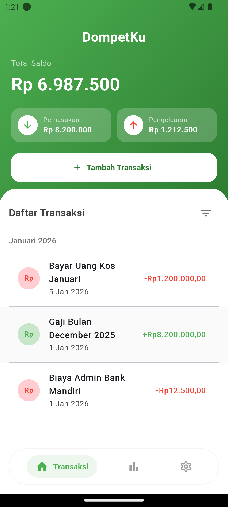
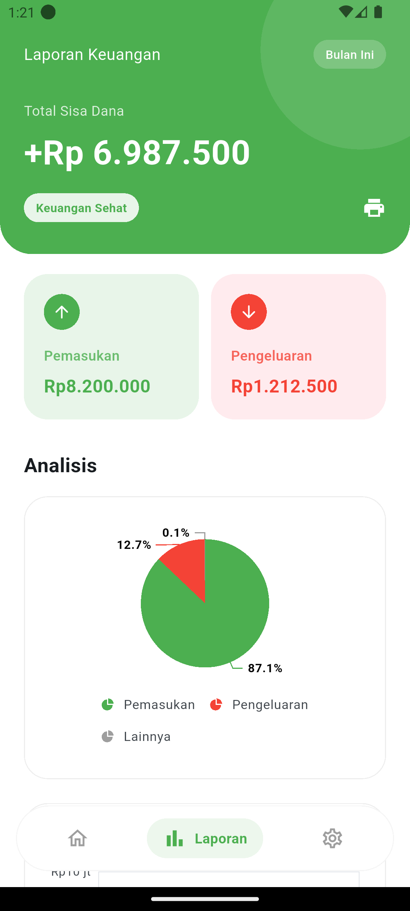
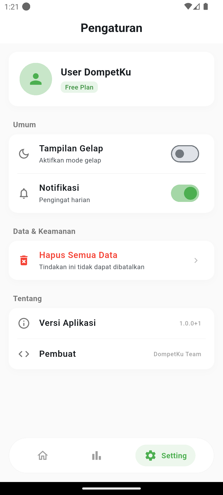
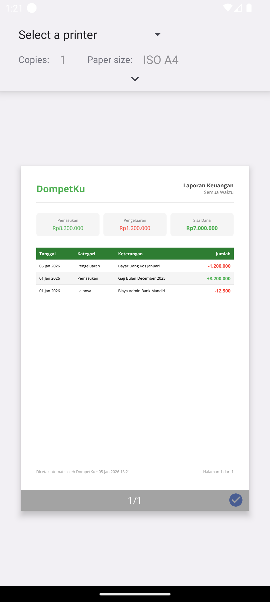

# DompetKu

Aplikasi manajemen keuangan pribadi yang modern, aman, dan bekerja sepenuhnya **Offline**. Aplikasi ini dirancang untuk membantu pengguna melacak pemasukan dan pengeluaran dengan mudah, serta menyediakan laporan keuangan yang rapi.

## 📱 Fitur Utama

-   **Offline First**: Semua data disimpan secara lokal di perangkat pengguna menggunakan SQLite. Privasi terjamin 100%.
-   **Pencatatan Transaksi**: Tambah pemasukan dan pengeluaran dengan kategori yang jelas.
-   **Statistik & Analisis**:
    -   Visualisasi data dengan **Pie Chart** (Pemasukan vs Pengeluaran).
    -   **Line Chart** untuk melihat tren harian.
-   **Laporan PDF**: Generate laporan keuangan profesional siap cetak.
-   **Mode Gelap/Terang**: (Tersedia di menu pengaturan).
-   **Manajemen Data**: Fitur hapus semua data untuk reset total.

## 🛠 Tech Stack

Aplikasi ini dibangun menggunakan teknologi dan library terkini di ekosistem Flutter dengan penerapan **Clean Architecture** untuk memastikan kode yang rapi, teruji, dan mudah dikembangkan.

### Core
-   **Framework**: [Flutter](https://flutter.dev/)
-   **Language**: [Dart](https://dart.dev/)

### Architecture & State Management
-   **Pattern**: Clean Architecture (Data, Domain, Presentation)
-   **State Management**: [flutter_bloc](https://pub.dev/packages/flutter_bloc)
-   **Dependency Injection**: [get_it](https://pub.dev/packages/get_it)
-   **Functional Programming**: [dartz](https://pub.dev/packages/dartz) (Untuk handling error `Either<Failure, Success>`)

### Local Storage (Offline)
-   **Database**: [sqflite](https://pub.dev/packages/sqflite)
-   **Path Provider**: [path_provider](https://pub.dev/packages/path_provider)

### UI & Visualization
-   **Charts**: [syncfusion_flutter_charts](https://pub.dev/packages/syncfusion_flutter_charts) (Pie Chart & Line Chart)
-   **Icons**: Cupertino Icons & Material Icons

### Utilities
-   **PDF Generation**: [pdf](https://pub.dev/packages/pdf) & [printing](https://pub.dev/packages/printing)
-   **Date Formatting**: [intl](https://pub.dev/packages/intl)
-   **App Info**: [package_info_plus](https://pub.dev/packages/package_info_plus)

## 📸 Screenshots

Berikut adalah tampilan antarmuka aplikasi DompetKu:

| Dashboard & Statistik | Laporan Keuangan | Pengaturan | Generator |
|:---:|:---:|:---:|:---:|
|  |  |  |  |

## 🚀 Getting Started

1.  **Clone Repository**
    ```bash
    git clone https://github.com/username/dompet_ku.git
    ```
2.  **Install Dependencies**
    ```bash
    flutter pub get
    ```
3.  **Run App**
    ```bash
    flutter run
    ```

---
*Dikembangkan dengan ❤️ oleh Tim DompetKu*
